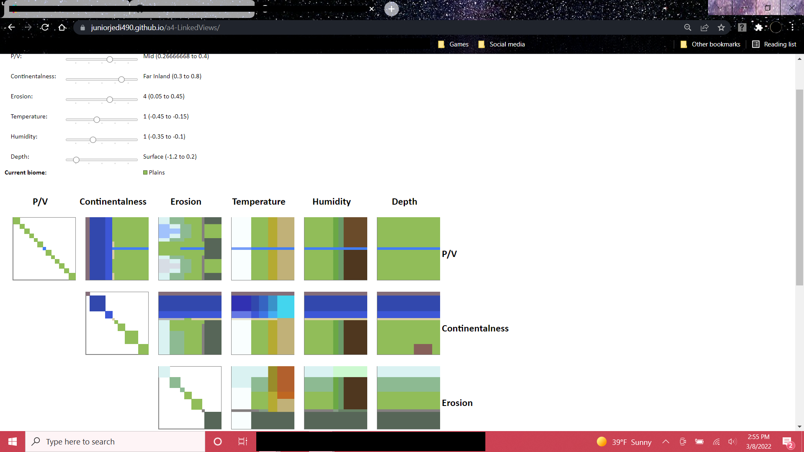

This project originated as my submission to an assignment from an Intro to Data Visualization class. This is the version that is updated to Minecraft 1.20. The original submission is archived in the "original-assignment-archive" branch.

In Minecraft 1.18 (Caves and Cliffs update part 2), Mojang completely overhauled the way the terrain is generated.

To summarize, terrain height is calculated by combining three Perlin Noise functions: Peaks and Valleys (P/V), Continentalness, and Erosion, each of which is also modified using a spline function.

In addition, a similar method is used to determine which biome an area is classified as. (That is what this project is focused on.)

Biome placement is determined using the same noise functions - P/V, Continentalness, and Erosion - as terrain, alongside two more noise functions (Temperature and Humidity). Cave biomes also use Depth, which starts at 0 on the world surface and increases by 1/128 for every block traveled downward.

This page allows you to change the P/V, Continentalness, Erosion, Temperature, Humidity, and Depth values freely, and see which biome results. The visualization is the grid of maps at the bottom, which show biomes that differ from the current one in up to 2 noise parameters. Clicking on one of the maps sets the currently selected biome to the biome clicked.

### Project link
https://juniorjedi490.github.io/a4-LinkedViews/

### Sample screenshot

### Technical achievements
- Ported the class used to construct Minecraft's biome source to JavaScript.
- Each data element has a tooltip and a click event.

### Design achievements
- The user can toggle between 2 color palettes: my personal custom one (referred to as "jj" in this project), and the one used in the seed mapping programs Amidst and Chunkbase. (The color change button is at the far bottom left)
- Noise values are displayed in the abstracted form shown in the game's debug screen.

### Works cited
- Video on terrain generation by Minecraft developer Henrik Kniberg: https://www.youtube.com/watch?v=CSa5O6knuwI
- Slider code comes from this demo: https://bl.ocks.org/johnwalley/e1d256b81e51da68f7feb632a53c3518
