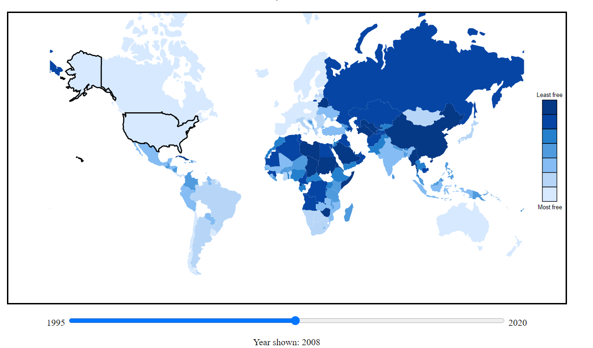
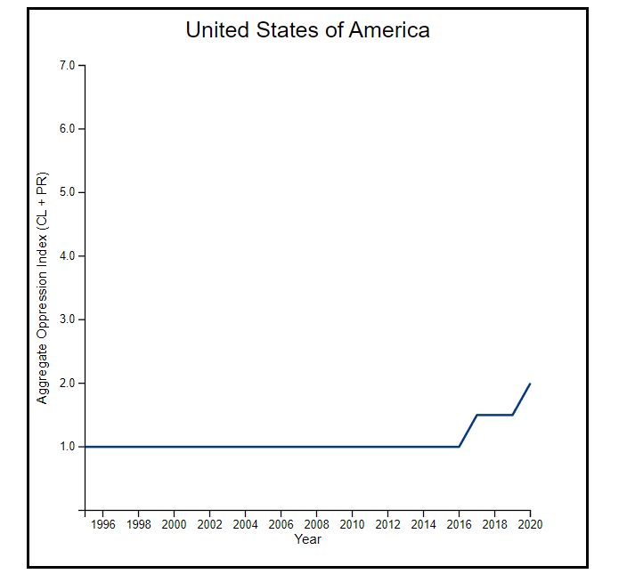

### CS480X A4 - Visualizing Freedom Around the World

This project focuses on visualizing a map of the world, looking at each country on a given freedom index as discussed in the dataset below from Tidy Tuesday:

https://github.com/rfordatascience/tidytuesday/tree/master/data/2022/2022-02-22

This dataset rates each country on a scale from 1 to 7 in the categories of Political Rights and Civil Liberties (PR and CL), with 1 being the most free and 7 being the most oppressive. In order to compute a general freedom/oppression scale for each country I took the average of the two values for each country, rounded this to get a number from 1 to 7, and applied a shading to each country based on this number. In addition, the dataset also is divided by year, giving individual values for each year from 1995 to 2020. A slider on the page allows the user to see how the freedom scores in each country have changed over time.

The second visualization applies to a single country, and this country can be selected by clicking on it on the map, adding interactivity. This second visualization shows a graph of the PR+CL oppression score over time over the entire period from 1995 to 2020, allowing trends for a single country to be easily visible.

The project can be hosted on my Github Page at https://iancoolidge0.github.io/a4-LinkedViews/.

### Technical Achievements

I created a map using topojson, and also used a custom div to draw a stats box when the user mouses over a given country. In addition, my two graphs are interactive and clicking in one can change the display in the other. Another technical standout of this project was cross-referencing country names in two separate datasets -- the topojson world map and the freedom dataset itself.

### Design Achievements

The two graphs use a similar color scheme to provide a cohesive experience for the viewer or user.