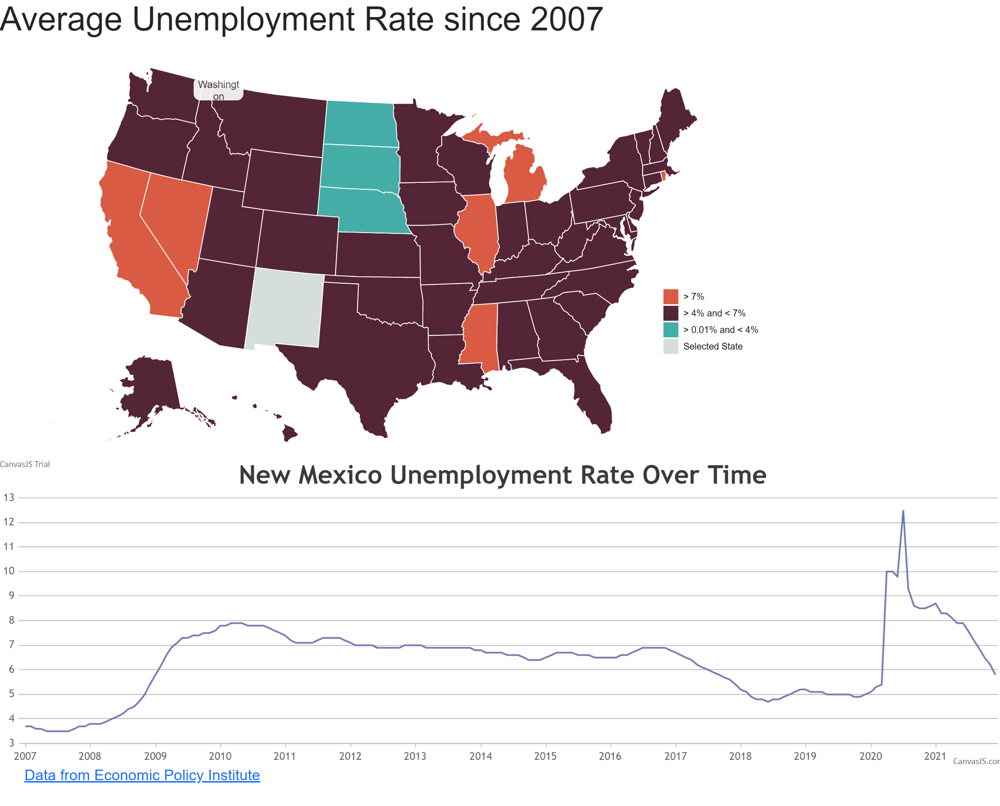

# General idea
The purpose of this visualization is to purpose an easy way to visualize unemployment rates for each state in the United States. 

## Technical Achievements and technologies used
The interactive map of the United States was made using D3 and it is an adapted code from
[Michelle Chandra](http://bl.ocks.org/michellechandra/0b2ce4923dc9b5809922). The interaction with the map is handled by two helper functions to clean and prepare data, then another helper function is used to plot a Canvas JS line chart. 
The design achievements were mostly centered within the code and not the UI. Once a state is selected its color also changes and its id is saved on a variable. This variable stores the current selected state so only that state has the color for selected states.